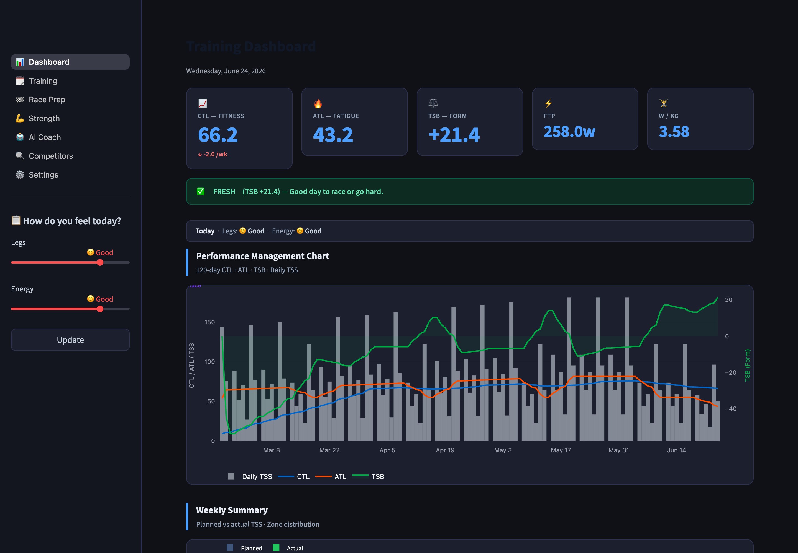
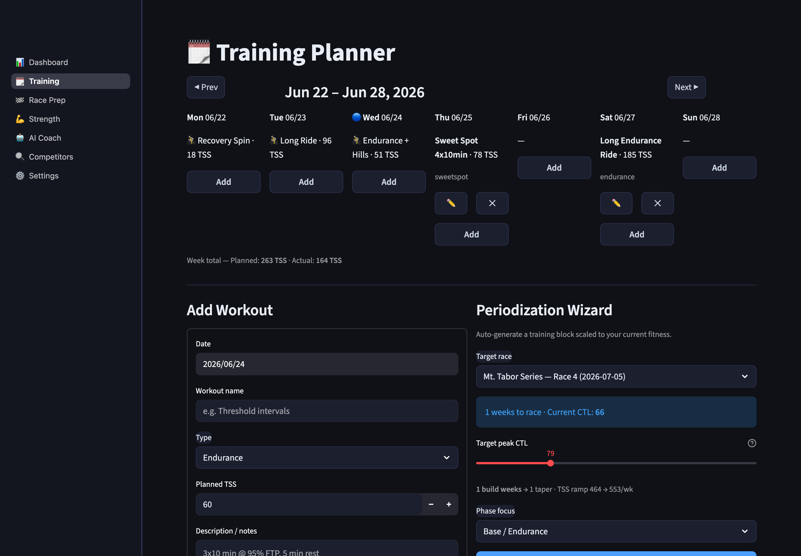
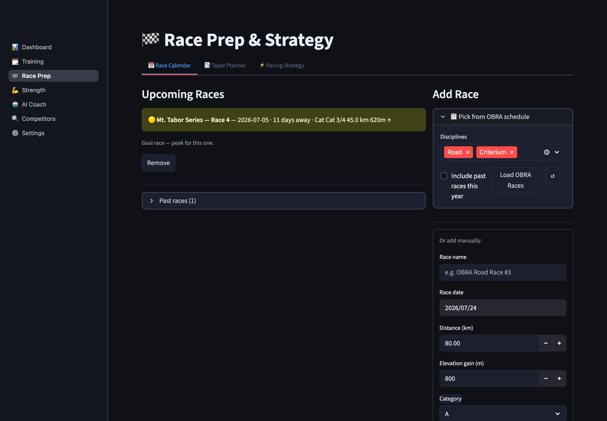
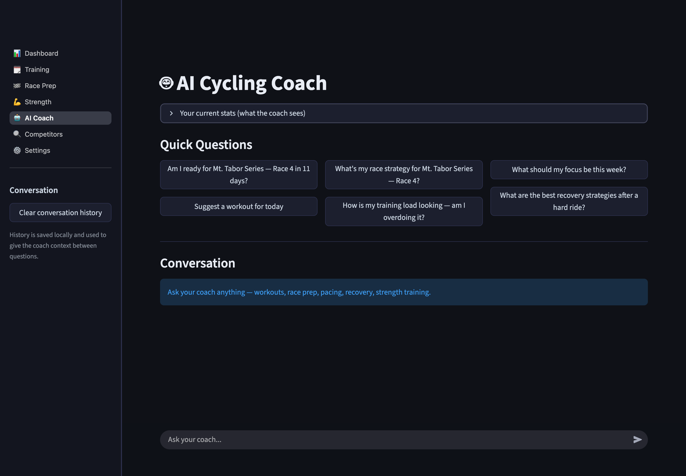

# Cycling Coach

A self-hosted training dashboard and AI coach for road/gravel cyclists. Syncs
rides from Strava and Garmin Connect, computes training load (CTL/ATL/TSB),
plans workouts, preps for races, and gives Claude-powered coaching advice —
all backed by a local SQLite database, no cloud account required.

## Screenshots

> _Screenshots use sample data._

**Training Dashboard** — CTL/ATL/TSB at a glance with a Performance Management Chart and daily check-in:



**Training Planner** — weekly plan plus a periodization wizard that scales a block toward a target peak CTL for your race:



**Race Prep** — race calendar, taper planner, and pacing strategy:



**AI Coach** — chat with Claude using your actual training data as context:



## Features

- **Training Load Dashboard** — CTL (fitness), ATL (fatigue), TSB (form) via a
  Performance Management Chart, daily wellness check-ins, weekly planned vs.
  actual TSS, and power/HR zone distribution.
- **Training Planner** — weekly calendar of planned workouts plus a
  periodization wizard that scales a training block from your current CTL to
  a target peak CTL ahead of a race.
- **Race Prep** — OBRA race calendar integration, taper planner, pacing
  strategy calculator, and post-race result logging.
- **Strength Training** — phase-based gym plans (off-season, build, taper)
  tailored for cycling-specific strength.
- **AI Coach** — chat with Claude using your actual training data (FTP,
  weight, CTL/ATL/TSB, recent rides, upcoming races, and stated goals) for
  specific, evidence-based coaching.
- **Competitor Research** — pulls OBRA public race results to scout fields
  and generate race tactics briefs.
- **Onboarding questionnaire** — new athletes pick their goals (speed,
  endurance, weight loss, race prep, general fitness), experience level, and
  weekly training hours; the app estimates starting FTP/LTHR/CTL and tailors
  AI Coach advice accordingly.

## Data sources

- **Strava** (OAuth) and **Garmin Connect** (garth-based auth) for activity
  sync, with automatic cross-source deduplication.
- Manual **.fit / .csv** ride import as a fallback when Garmin auth is
  rate-limited.
- **OBRA** (Oregon Bicycle Racing Association) public schedule and results
  for race calendar and competitor research.

## Stack

Python · Streamlit · SQLite · Plotly · Anthropic Claude API

## Setup

```bash
cp .env.example .env   # fill in your API keys
bash setup.sh
bash start.sh
```

See `.env.example` for required keys (Strava, Garmin, Anthropic). Garmin
auth requires a one-time interactive login — run `scripts/garmin_setup.py`
once if Garmin shows a bot-protection challenge.

## Project layout

```
app.py                  Entry point — setup gate, onboarding gate, navigation
pages/                  Dashboard, Training Planner, Race Prep, Strength,
                         AI Coach, Competitors, Settings
db/                     SQLite schema + queries
auth/                   Strava OAuth, Garmin auth, .fit/.csv import
metrics/                Training load (CTL/ATL/TSB) and zone estimation
research/               OBRA schedule + race results scraping
components/             Shared UI (styles, cards, onboarding)
scripts/                One-off setup scripts (Garmin auth)
```

Single-user by design — each person runs their own copy with their own
`.env` and local database.
